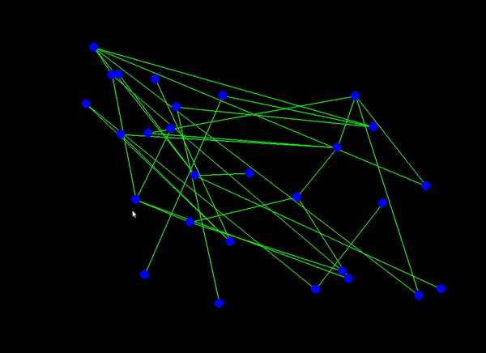

# Force-directed graph drawing algorithm
## โดย [Copy Paste Engineer](https://www.facebook.com/CopyPasteEng)



คลิปเนื้อหา: [Python Graph Visualization - วาด Network ยังไงให้สวย! (Concept + Code)](https://youtu.be/kC3FLt9UcdM)

วิธีรัน:
```
pip install -r requirements.txt  # install modules ต่าง ๆ
python main.py
```

สามารถแก้ config, ค่าคงตัวต่าง ๆ ได้จากไฟล์ [`config.yml`](config.yml)
